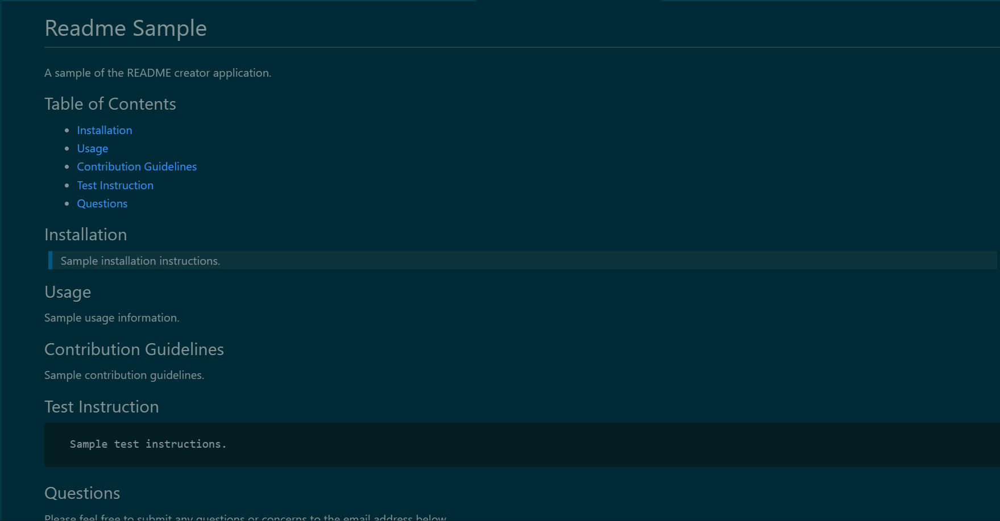

# README Creator
A README file creating application that takes in user imput through a command-line prompt and generates a unique README.md file with the user's input. The README created follows professional standards and includes license generation.

Below is a link to the walkthrough video.  

**Update**: Video walkthrough does not properly display the license rendering, however it was fixed in the code.

[Video Walkthrough](./sample/README%20Creator%20Walkthrough.mp4)

Screenshot of sample README:

